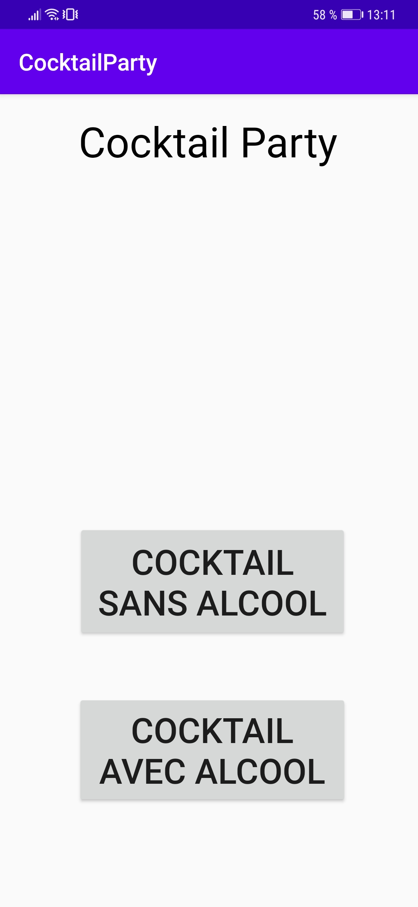
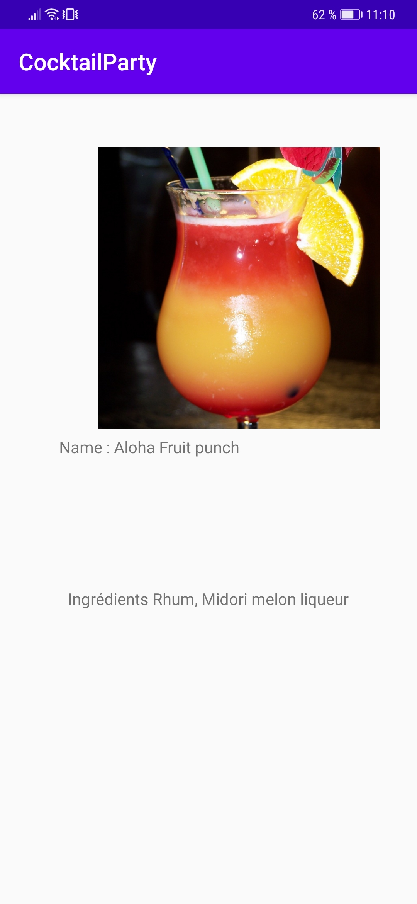
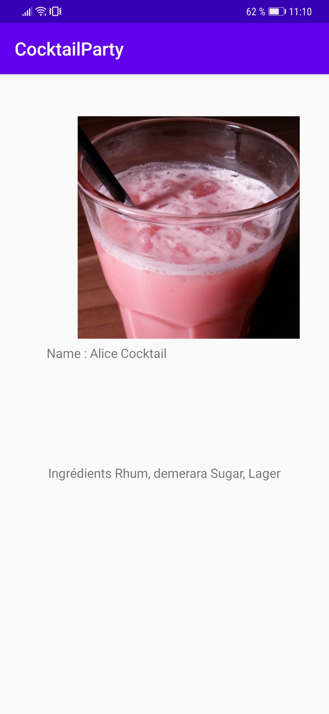

# CocktailParty

# Présentation

Cette application codée en java affiche des cocktail et les ingrédients nécessaire grace a une API Rest

# Prérequis
	- Installation d'Android Studio

# Consignes respectées :
	- Ecran avec une liste d'éléments
	- Ecran avec le détail d'un élément
	- Appel WebService à une API Rest
	- Stockage de données en cache

# Fonctionnalités :

# Premier écran

# Ecran liste 

# Ecran des ingrédients
 
